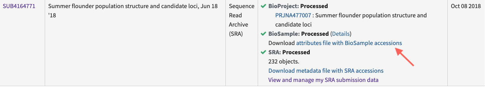
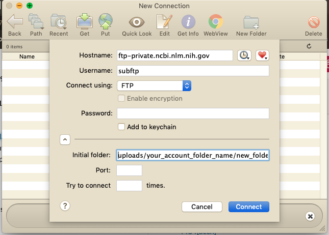

# **Guide to contributing to NCBI SRA**

Are you looking to make your science more reproducible and transparent by making your data public? Or do you need to upload your data somewhere before your manuscript can be published? The NCBI Sequence Reach Archive (SRA) is a public searchable platform where genetic data and associated metadata may be uploaded, downloaded and reused.

## **Getting started**:
Before beginning, it is helpful to read through several NCBI pages to understand the necessary data that is required for a successful upload. A good starting point is [here](https://www.ncbi.nlm.nih.gov/sra/docs/submitportal/). Understanding NCBI's data hierarchy will also be helpful for understanding how your data should be submitted.

####A summary of NCBI prefixes####

| Prefix | Accession Name | NCBI Definition | Example |
|--- | --- | ---|:---:|
|PRJNA | BioProject | The goal of your research effort | [PRJNA477007](https://www.ncbi.nlm.nih.gov/bioproject/PRJNA477007/)|
|SRP | Study | An object that contains project metadata describing sequencing study or project | [SRP150953](https://trace.ncbi.nlm.nih.gov/Traces/sra/sra.cgi?study=SRP150953)|
|SAMN | Sample | An object that contains metadata describing the physical sample upon which a sequencing experiment was performed | [SAMN09463455](https://www.ncbi.nlm.nih.gov//biosample/SAMN09463455)|
|SRX | Experiment | An object containing metadata describing the library, platform selection and processing parameters involved in a sequencing experiment | [SRX7621456](https://www.ncbi.nlm.nih.gov/sra/SRX7621456[accn])|
|SRR | Run | An object containing actual sequencing data for a sequencing experiment. Experiments may contain multiple runs if multiple sequencing instrument runs were needed, but preferable data structure is one run per experiment | [SRR10954732](https://trace.ncbi.nlm.nih.gov/Traces/sra/?run=SRR10954732)|

## **Submitting**:
**Log in on to the [SRA Submission Portal Wizard](https://submit.ncbi.nlm.nih.gov/subs/sra/)**

**Create new submission** by clicking on the 'New Submission' button. Your submission will receive a temporary SUB# ID, and you can use this to contact SRA staff if you have issues.

#####Follow steps (you can leave at any step and return to it later). The Submission Portal will check to make sure everything is okay after each step and your position will be displayed on the progress bar.

 Figure 1. NCBI SRA submission progress bar

**1. Submitter information**

You will be asked for your contact information and affiliations. You can also create a Group, which will allow your collaborators to read, modify, submit and delete your submissions.

**2. General information**

You will be asked if you already registered your project and samples. Select yes or no. If yes, enter the accession number for your existing BioProject and you will be redirected to Step #6. If no, the Wizard will ask you to create them. Select the release date for your data. The default is immediately.

**3. Project information**

Enter information about your project, including title, a description and grant information.

**4. BioSample type**

Select the best description for your data. A Pinsky Lab example would be 'Model organism or animal sample'.

**5. BioSample attributes**

You will be asked to provide information about your samples. You can either enter it directly into the built-in editor, or download a BioSamples template, fill it out and upload it.

Enter each sample as a separate line and follow the directions on the template with regards to each of the colored data columns to ensure all necessary data have been included.

A complete BioSamples template can be viewed [here](https://github.com/pinskylab/SRA-submission/blob/master/PADE_NCBI_biosamples.xlsx).

**6. SRA metadata**

If you are entering metadata for new BioSamples, you may either enter the metadata using the built-in editor, or you may download a SRA metadata template, fill it out and upload it. Follow the instructions on the template to ensure all required information about sequencing methodology is included. An example of a SRA metadata template for new BioSamples may be viewed [here](https://github.com/pinskylab/SRA-submission/blob/master/SRA_metadata_PADE.xlsx).

If you have previously uploaded SRA metadata, download and complete the SRA metadata template. You must make sure that you include the BioSample accession number so that your new sequences are correctly linked to your existing BioSamples. An easy way to obtain these is to navigate to your previous submission within the submission portal and then to Download the attributes file with BioSample accessions (Figure 2).

 Figure 2. Where to download a file with BioSample accession numbers for previously submitted samples

**7. Files**

NCBI SRA accepts different file types. The Pinsky Lab aims to contribute FASTQ and BAM files for each sequenced individual, plus the reference that reads are aligned to. More information about file types may be found [here](https://www.ncbi.nlm.nih.gov/sra/docs/submitformats/). The file names need to be the same as those that you specified in the SRA Metadata.

As genomic data are large, there are several ways to transfer your sequence data to the NCBI SRA. Within this section of the Submission Portal, NCBI offers several ways to transfer your data: HTTP/Aspera Connect Plugin, FTP/Aspera Command Line or Amazon S3. If your data are less than 10 GB or you have fewer than 300 individuals, you can try to drag files directly into the Submission Portal, which will upload via HTTP. If your data are larger, select `Request preload folder` button. If you select the method you would like to use, some brief instructions will appear. Here, we will discuss various FTP options in more detail. Note that the time it takes to transfer your data will depend on the size of your data (often hours to days). 

**FTP using the command line**

1. Create a single directory with all the files you want to upload.
2. Ensure you have FTP. You may need to install if not.
3. Navigate to the directory all the files you want to upload are.
3. Establish a FTP connection by typing `ftp -i`.
4. Next, type `open ftp-private.ncbi.nlm.nih.gov`.
5. Provide your username this is listed in the Submission Portal, likely `subftp`.
6. Provide the password listed in the Submission Portal.
7. Navigate to your account folder listed in the Submission Portal: `cd uploads/your_account_folder_name`
8. Create a subfolder. You must do this or you will not be able to see your files in the preload option: `mkdir new_folder_name`
9. Navigate into the target folder: `cd new_folder_name`
10. Copy your files into the target folder: `mput *`
11. Go back to the Submission Portal and select the folder to upload. It takes at least 10 minutes for transferred files to appear in the preload option.
12. To exit the FTP window, type `bye`.
 	

**FTP using third-party software (Fetch, for example)**

1. Open a Fetch window and connect to the NCBI server by typing in the hostname, your username and password, and direct Fetch to your `new_folder_name`  within `your_account_folder_name` (Figure 3).
2. Open another Fetch window and connect to the location of your data.
3. Highlight the files you want to transfer and drag into the Fetch window that is connected to the NCBI server. This will copy your files from your server to the NCBI server.
4. Go back to the Submission Portal and select the folder to upload. It takes at least 10 minutes for transferred files to appear in the preload option.

 
Figure 3. Screenshot showing how to connect to the NCBI server using Fetch

**8. Review & submit**

The Submission Portal will check to make sure all your sequencing files have correctly transferred. It will also check to make sure that you have uploaded sequence data for all listed BioSamples. Review all the information before completing the submission. If an error arises during processing, you'll receive an email asking you to contact SRA staff.

## **Troubleshooting**:
If you run into trouble, there is a [SRA Submission Portal Troubleshooting Guide](https://www.ncbi.nlm.nih.gov/sra/docs/submitspfiles), or email SRA staff at [sra@ncbi.nlm.nih.gov](sra@ncbi.nlm.nih.gov)

